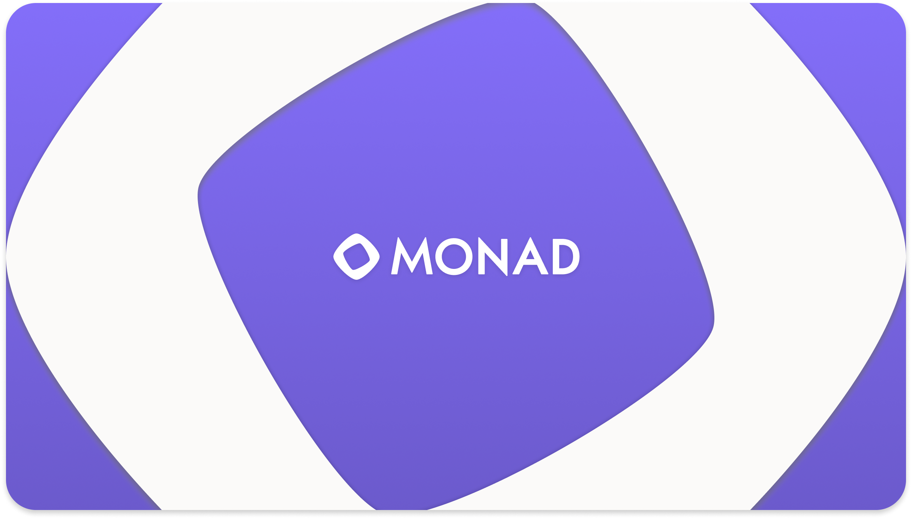

<div align="center">
  
  <h1>Tamagotchi Monad</h1>
  
  <p>
    <b>The Multiplayer NFT Tamagotchi for the Monad Community</b> <br/>
    <i>Powered by Monad <span style="color:#8058a8;">•</span> Maxis Edition</i>
  </p>
</div>

---

## 🎮 Live Demo

🔗 [Try it on Vercel now!](https://tamagotchi-monad.vercel.app/)

---

## 🟣 What is This?

**Tamagotchi Monad** is a fully open-source, multiplayer NFT pet dapp built for the Monad Testnet & Hackathon.  
Anyone can mint a Tamagotchi NFT, feed, play, and interact with it — with beautiful Monad purple branding, the official Monad logo, and permanent “Maxis” watermark for a unique identity!

**Key features:**
- 🟪 **Supports ALL EVM wallets:** HaHa Wallet, MetaMask, Rabby, OKX, TrustWallet, and others
- 🟣 **Mint, feed, and play** your NFT Tamagotchi — provably on-chain!
- ✨ **Monad purple UI** with logo and Maxis watermark
- 🏆 Super easy-to-use, responsive for any user or judge
- 🔒 Open source and community ready

---

## 🚀 How To Run Locally

1. **Clone this repo:**
    ```bash
    git clone https://github.com/Maxis47/tamagotchi-monad.git
    cd tamagotchi-monad
    ```

2. **Install dependencies:**
    ```bash
    npm install
    ```

3. **Run app locally:**
    ```bash
    npm run dev
    ```
    Then open [http://localhost:5173](http://localhost:5173) in your browser.

4. **Connect your wallet (Monad Testnet)!**

---

## 🏗 How to Deploy Smart Contract

- The `abi.json` in `/src` is generated from the Solidity contract in this repo (see `/contract/` if exists).
- Deploy the contract below to Monad Testnet using Remix IDE.
- Copy your deployed contract address and ABI to frontend `CONTRACT_ADDRESS` and `src/abi.json`.

---

## 💻 Smart Contract

> **Address:** `0xbb794f7DcbCDa76D7d9994BbF49b8e53F01253F0`  
> **Explorer:** [View on Monad Explorer](https://testnet-explorer.monad.xyz/address/0xbb794f7DcbCDa76D7d9994BbF49b8e53F01253F0)

---

## 🌈 Branding & Credits

- Official **Monad logo** appears in the header and footer.
- Every page is watermarked with “Maxis” — always visible.
- Tamagotchi pixel art by [your-artist-source], freely usable for hackathon/educational purposes.

---

## 📸 Screenshot

<div align="center">
  <!-- You can add your screenshot here! -->
  <!--  -->
</div>

---

## 📦 For Hackathon Judges

- All EVM wallet support (HaHa, MetaMask, Rabby, OKX, etc), true cross-extension compatible
- User-friendly: Mint button never disappears, connects reliably, clear status/error
- Distinctive Monad branding & Maxis watermark
- 100% open-source, easy to inspect or fork

---

## 🫂 For the Community

Fork, remix, or use as onboarding for Monad!  
This Dapp lives for hackathons, demo, and real adoption.

---

## 🛡 License

MIT.  
UI and code open source, any branding (logo/watermark) must be preserved for demo, hackathon, and education.

---

**© Maxis • Monad Hackathon**  
Happy hacking, & thank you judges & Monad fam! 🚀
